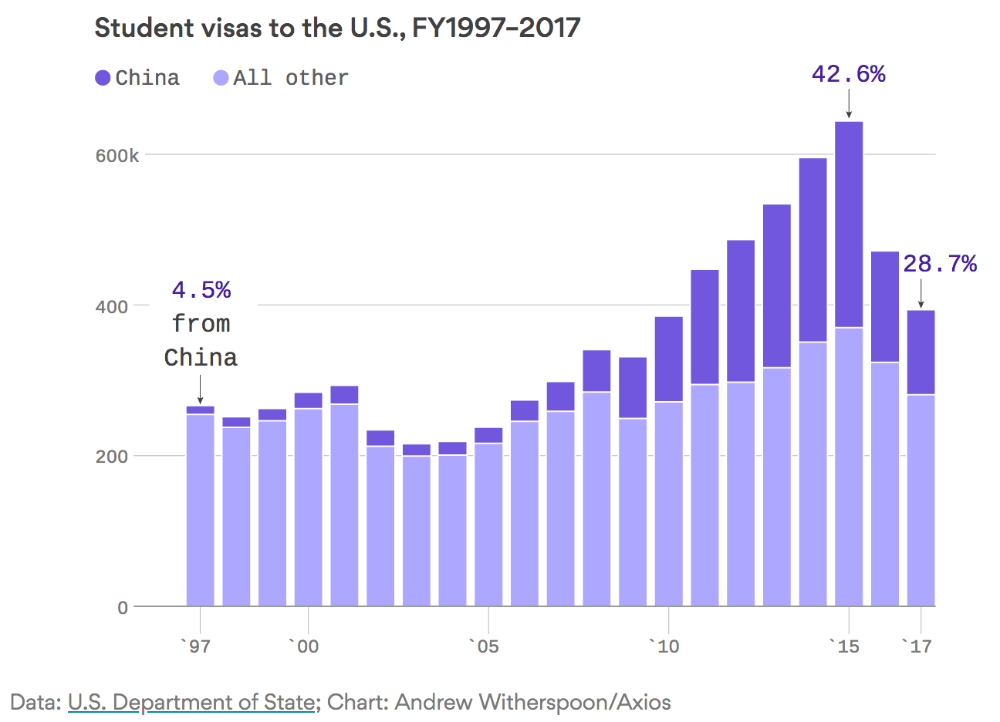

# US Anti-Plugs

Whenever I come across a media mention of how the US is screwing up immigration, tech, etc., I add it to this list.
This is the counterpart to the [Waterloo plugs](waterloo-plugs.md) page.

Being an American, it pains me to add entries to this page...

---

May 30, 2018 - [The US is limiting visas for Chinese international students majoring in tech](https://www.theverge.com/2018/5/30/17410824/us-limiting-chinese-visa-international-students-technology-majors): The latest victim in the technology race is students

May 6, 2018 - [The disappearing Chinese student visa](https://www.axios.com/foreign-student-visas-dropping-china-india-trump-81e70609-9fa7-43eb-8f40-ccfef9fe3fa5.html): There was a 17% drop in international students in the U.S. last year, mostly due to the 28% decline in Indian students and a 24% decline in Chinese students receiving visas.

March 23, 2018 - [FBI Director Defends Remarks That Chinese People In U.S. Pose Threats](https://www.huffingtonpost.com/entry/fbi-christopher-wray-chinese-immigrants_us_5ab3d47fe4b008c9e5f51975): Wray has received immense backlash from Asian-American civil rights organizations for his comments about "the China threat."

March 23, 2018 - [Don't Slam the Door on Chinese Students](https://www.bloomberg.com/view/articles/2018-03-23/reducing-visas-for-chinese-students-is-un-american): Reducing student visas for foreigners is self-defeating and un-American.

March 11, 2018 - [Visas Issued to Foreign Students Fall, Partly Due to Trump Immigration Policy](https://www.wsj.com/articles/visas-issued-to-foreign-students-fall-partly-due-to-trump-immigration-policy-1520766000): Fewer foreign students exacerbate financial challenges for some U.S. universities.

March 5, 2018 - [Fewer international grad students are seeking computer science degrees in the U.S. for the first time in years](https://www.geekwire.com/2018/fewer-international-grad-students-seeking-computer-science-degrees-u-s-first-time-years/): The number of international students enrolling in American universities is declining for the first time in years, amid volatile shifts in U.S. immigration policy.

January 18, 2018 - [Fewer international students coming to US for grad school in science and engineering](https://www.pri.org/stories/2018-01-18/fewer-international-students-coming-us-grad-school-science-and-engineering): Science and engineering fields saw a 6 percent decrease in international graduate students from the fall of 2016 to the fall of 2017, and almost all of that decrease was concentrated in two fields: computer science and engineering.
