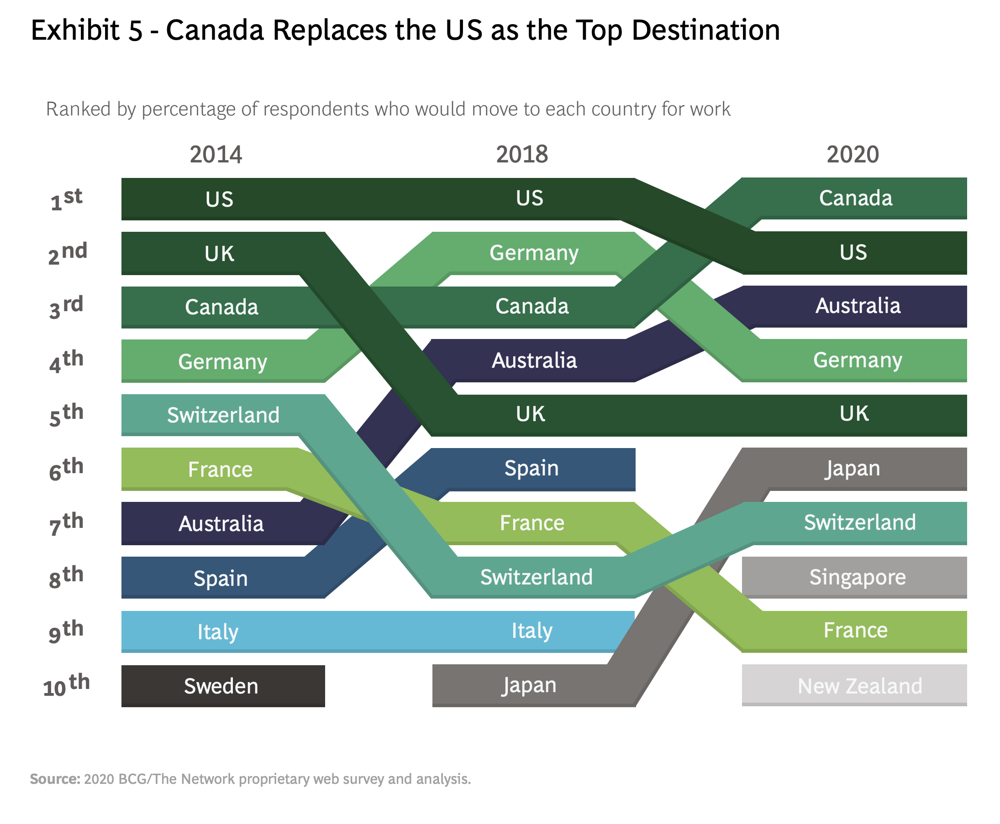
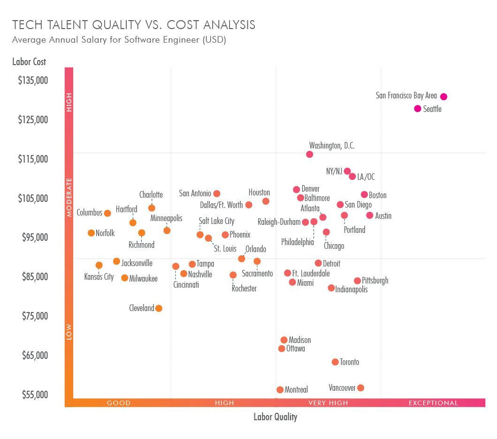

# Waterloo Plugs

Every time I come across a media mention of the burgeoning tech scene in Waterloo, the GTA ([Greater Toronto Area](https://en.wikipedia.org/wiki/Greater_Toronto_Area)), or Canada in general, I make note of it here.

I'll admit, some of these reports are a bit "flaky" and hype-ish... so take with a big grain of [NaCl](https://en.wikipedia.org/wiki/Salt).

---

<blockquote class="twitter-tweet">
The region is home to some of the world’s most liveable cities, according to an index by the EIU. Explore the list
&mdash; The Economist (@TheEconomist) <a href="https://twitter.com/TheEconomist/status/1557641939750633473?ref_src=twsrc%5Etfw">August 11, 2022</a></blockquote>

August 5, 2022: [The best places to live in North America](https://www.economist.com/graphic-detail/2022/08/05/the-best-places-to-live-in-north-america) &mdash; They’re in Canada.

<blockquote class="twitter-tweet">
Nine startups with links to <a href="https://twitter.com/UWaterloo?ref_src=twsrc%5Etfw">@UWaterloo</a> were named in a recent report tracking Canadian companies on their way to $1 billion annual revenues, including four companies that grew out of <a href="https://twitter.com/hashtag/UWaterloo?src=hash&amp;ref_src=twsrc%5Etfw">#UWaterloo</a>’s startup incubator <a href="https://twitter.com/UWVelocity?ref_src=twsrc%5Etfw">@UWVelocity</a>.  Read this story: <a href="https://t.co/Uw1oa9ZHZ0">https://t.co/Uw1oa9ZHZ0</a> <a href="https://t.co/LfYxxvd6DC">pic.twitter.com/LfYxxvd6DC</a>
&mdash; University of Waterloo (@UWaterloo) <a href="https://twitter.com/UWaterloo/status/1550485088407896064?ref_src=twsrc%5Etfw">July 22, 2022</a></blockquote>

July 21, 2022 - [Waterloo-linked startups on track for billion-dollar annual revenues](https://uwaterloo.ca/news/waterloo-linked-startups-track-billion-dollar-annual): Communitech report highlights Canadian companies with impressive growth.

July 4, 2022 - [Toronto-Waterloo Region Corridor highlighted in 2022 Startup Genome rankings](https://uwaterloo.ca/news/toronto-waterloo-innovation-corridor-rankings-2022): University of Waterloo support for startup community, vision and values reflected in GSER top-20 rank. [Key Insights from #GSER2022](https://startupgenome.com/report/gser2022)

June 14, 2022 - [Startup Genome report highlights Toronto-Waterloo growth](https://blog.waterlooedc.ca/toronto-waterloo-startup-genome-2022): top tech ecosystem in Canada, #8 in North America and #17 globally.

March 21, 2022 - [Toronto, the Quietly Booming Tech Town](https://www.nytimes.com/2022/03/21/technology/toronto-tech-boom.html): For all the excitement around places like Austin and Miami, the biggest tech expansion has been in Canada’s largest city. ([IA copy](https://web.archive.org/web/20220321070516/https://www.nytimes.com/2022/03/21/technology/toronto-tech-boom.html))

<blockquote class="twitter-tweet">
In 2021, Waterloo Region welcomed new leaders at two of our most important tech institutions, <a href="https://twitter.com/Communitech?ref_src=twsrc%5Etfw">@Communitech</a> CEO <a href="https://twitter.com/chrisalbinson?ref_src=twsrc%5Etfw">@ChrisAlbinson</a> and the <a href="https://twitter.com/AC_Waterloo?ref_src=twsrc%5Etfw">@AC_Waterloo</a> CEO Jay Krishnan. Find out how they are bringing fresh perspectives to our innovation ecosystem. <a href="https://t.co/kN2STjZfhr">https://t.co/kN2STjZfhr</a>
&mdash; Waterloo EDC (@WaterlooEDC) <a href="https://twitter.com/WaterlooEDC/status/1461405089218891782?ref_src=twsrc%5Etfw">November 18, 2021</a></blockquote>

November 18, 2021 - [Waterloo’s new leaders on revitalizing our tech ecosystem](https://blog.waterlooedc.ca/new-leaders-waterloo-tech-ecosystem)

<blockquote class="twitter-tweet">
Waterloo well-represented on Deloitte Technology Fast 50 <a href="https://t.co/WkdTETb18I">https://t.co/WkdTETb18I</a>
&mdash; R+T PARK (@RTPARKUW) <a href="https://twitter.com/RTPARKUW/status/1462757507236089858?ref_src=twsrc%5Etfw">November 22, 2021</a></blockquote>

November 17, 2021 - [Waterloo well-represented on Deloitte Technology Fast 50](https://blog.waterlooedc.ca/waterloo-deloitte-technology-2021): Once again, Waterloo is home to some of Canada’s fastest-growing tech companies, according to a new ranking from Deloitte. The Deloitte Technology Fast 50 list ranks companies by revenue growth percentage over their last four years of operation. In past years, Waterloo has dominated the list, scoring the top three companies in 2019 and top two companies in 2020.

<blockquote class="twitter-tweet">
Which college’s alumni generate outsized returns for investors?  According to our new study based on markup rates, <a href="https://twitter.com/UW?ref_src=twsrc%5Etfw">@UW</a>, <a href="https://twitter.com/UWaterloo?ref_src=twsrc%5Etfw">@UWaterloo</a>, and <a href="https://twitter.com/BrownUniversity?ref_src=twsrc%5Etfw">@BrownUniversity</a> lead the way.  Read the full study here: <a href="https://t.co/941QYl0Zyy">https://t.co/941QYl0Zyy</a>
&mdash; AngelList (@AngelList) <a href="https://twitter.com/AngelList/status/1425499724484861960?ref_src=twsrc%5Etfw">August 11, 2021</a></blockquote>

August 11, 2021 - [How Does a Founder's Alma Mater Impact Their Startup's Markup Rate?](https://www.angellist.com/blog/founder-schools) Ranking colleges by the markup rate of their alumni’s startups.

August 4, 20201 - [Velocity companies secure more than $2 billion in funding](https://uwaterloo.ca/news/media/velocity-companies-secure-more-2-billion-funding): Investments in software and services, deep-tech drive dramatic growth

March 31, 2021 - [10 exciting companies founded by UWaterloo alumni](https://blog.waterlooedc.ca/uwaterloo-alumni-founders)

March 17, 2021 - [Canada is the world’s #1 destination for global talent](https://blog.waterlooedc.ca/canada-top-destination-global-talent) according to a report by the Boston Consulting Group.

March 4, 2021 - [US Falls Behind Canada as a Work Destination](https://www.bcg.com/press/4march2021-us-falls-behind-canada-work-destination-pandemic-lowers-mobility-global-workforce-study) according to a Survey of 209,000 People in 190 Countries by Boston Consulting. [[PDF](https://web-assets.bcg.com/cf/76/00bdede345b09397d1269119e6f1/bcg-decoding-global-talent-onsite-and-virtual-mar-2021-rr.pdf)]

November 17, 2020 - [5 Charts: Waterloo vs. America's top emerging tech hubs](https://blog.waterlooedc.ca/5-charts-waterloo-vs-americas-top-emerging-tech-hubs)

November 17, 2020 - [Canada, a destination for AI talent and innovation](https://www.cifar.ca/cifarnews/2020/11/17/a-look-toward-2030)

<blockquote class="twitter-tweet">
Canada is a destination for talent in artificial intelligence &amp; innovation thanks to our vibrant AI ecosystem: Elissa Strome, ED of the CIFAR Pan-Canadian AI Strategy on the Strategy&#39;s impact to date at <a href="https://twitter.com/Mila_Quebec?ref_src=twsrc%5Etfw">@Mila_Quebec</a> <a href="https://twitter.com/VectorInst?ref_src=twsrc%5Etfw">@VectorInst</a> <a href="https://twitter.com/AmiiThinks?ref_src=twsrc%5Etfw">@AmiiThinks</a><a href="https://t.co/L1UpbKiJeV">https://t.co/L1UpbKiJeV</a> <a href="https://t.co/EEq3HjIH6M">pic.twitter.com/EEq3HjIH6M</a>
&mdash; CIFAR (@CIFAR_News) <a href="https://twitter.com/CIFAR_News/status/1331621207435829248?ref_src=twsrc%5Etfw">November 25, 2020</a></blockquote>

August 13, 2020 - [Canadian tech group spends $100K on billboards to lure anxious tech workers from U.S.](https://www.cbc.ca/news/canada/kitchener-waterloo/tech-billboards-1.5683762): Campaign aimed at tech workers worried by Trump administration work visa ban.

<blockquote class="twitter-tweet">
&quot;Workers who contact Communitech will get information about Canadian work permits and job boards, including opportunities across the country from <a href="https://twitter.com/VIATEC?ref_src=twsrc%5Etfw">@Viatec</a> in B.C. to Volta Labs(<a href="https://twitter.com/voltaeffect?ref_src=twsrc%5Etfw">@voltaeffect</a>) in Nova Scotia.&quot;<a href="https://t.co/3tXpD1JSqw">https://t.co/3tXpD1JSqw</a>
&mdash; Communitech (@Communitech) <a href="https://twitter.com/Communitech/status/1293920023686320129?ref_src=twsrc%5Etfw">August 13, 2020</a></blockquote>

June 17, 2020 - [Toronto would like to be seen as the nice person’s Silicon Valley, if that’s not too much trouble](https://www.technologyreview.com/2020/06/17/1003314/toronto-would-like-to-be-seen-as-the-nice-persons-silicon-valley-if-thats-not-too-much-trouble/)

February 8, 2020 - [Google's expansion plans show why Canada's tech boom is here to stay](https://www.cbc.ca/news/business/google-canada-expansion-analysis-1.5455122): A decade ago, Canada's tech industry was worried about extinction — now it's Silicon Valley North.

December 9, 2019 - [Canada’s top international AI talent grows to 80](https://www.cifar.ca/cifarnews/2019/12/09/canada-s-top-international-ai-talent-grows-to-80)

<blockquote class="twitter-tweet">
Today we announce 34 new Canada CIFAR Artificial Intelligence Chairs.  cc <a href="https://twitter.com/AmiiThinks?ref_src=twsrc%5Etfw">@AmiiThinks</a> <a href="https://twitter.com/MILAMontreal?ref_src=twsrc%5Etfw">@MILAMontreal</a> <a href="https://twitter.com/VectorInst?ref_src=twsrc%5Etfw">@VectorInst</a> <a href="https://twitter.com/hashtag/realbrains?src=hash&amp;ref_src=twsrc%5Etfw">#realbrains</a><a href="https://t.co/MvQObspJGO">https://t.co/MvQObspJGO</a>
&mdash; CIFAR (@CIFAR_News) <a href="https://twitter.com/CIFAR_News/status/1204084983750676486?ref_src=twsrc%5Etfw">December 9, 2019</a></blockquote>

June 25, 2019 - [Google is preparing for a major expansion of its Canadian engineering headquarters on Breithaupt Street in Kitchener](https://www.therecord.com/news-story/9449961-google-is-preparing-for-a-major-expansion-of-its-canadian-engineering-headquarters-on-breithaupt-street-in-kitchener/)

May 26, 2019 - this thread:

<blockquote class="twitter-tweet" data-lang="en">
With the <a href="https://twitter.com/hashtag/Raptors?src=hash&amp;ref_src=twsrc%5Etfw">#Raptors</a> about to hit the global stage, I’m going to share a story about what makes Toronto, and Canada, so special.  It’s about a guy you’re going to be seeing a whole lot of.  A Thread.  [Hint:  It&#39;s about racism, sports, and why you&#39;ll end up cheering for 🍁]
&mdash; Muhammad Lila (@MuhammadLila) <a href="https://twitter.com/MuhammadLila/status/1132705598632538113?ref_src=twsrc%5Etfw">May 26, 2019</a></blockquote>

May 23, 2019 - [Global Push Has Dividends for Toronto-Waterloo](http://news.communitech.ca/global-focus-paying-dividends-for-toronto-waterloo/): "[about the Waterloo Region:] an amazing ecosystem. It’s producing one of the highest number of startups per population, which means its funnel, its entrepreneurial mindset, spirit, the strength of the community as an engine for the region, is just so strong. It’s very impressive in that way. Waterloo has 1,100 startups per million people, or something like that. Silicon Valley is at 2,000. But everybody else is at 300, 400, 500. So it continues to create a very dynamic ecosystem. I think this is a real strength."

April 10, 2019 - [Scoring Tech Talent in North America 2018](https://www.cbre.com/research-and-reports/Scoring-Tech-Talent-in-North-America-2018)

<blockquote class="twitter-tweet">
Common takeaway from this chart: Canada is a bargain for AI talent  Reality: difference between “good” and “exceptional” is huge, ROI more than justifies 2X costs<a href="https://t.co/cNQQfCnVUj">https://t.co/cNQQfCnVUj</a> <a href="https://t.co/Zy98avDKrH">pic.twitter.com/Zy98avDKrH</a>
&mdash; Gilad Mishne (@gilad) <a href="https://twitter.com/gilad/status/1116086700533407744?ref_src=twsrc%5Etfw">April 10, 2019</a></blockquote>

March 3, 2019 - [Smaller Countries Are Becoming the Healthiest](https://www.bloomberg.com/news/articles/2019-03-04/global-wellness-rankings-these-are-the-best-places-to-live): A new analysis, the Global Wellness Index published by investment firm LetterOne, ranks Canada as the best country out of the 151 nations evaluated. The U.S. trails far behind, coming in at 37.

February 27, 2019 - [2019 QS World University Rankings places computer science at Waterloo 22nd globally](https://cs.uwaterloo.ca/news/2019-qs-world-university-rankings-places-computer-science)

December 18, 2018 - [Indian technology talent is flocking to Canada](https://www.economist.com/business/2018/12/22/indian-technology-talent-is-flocking-to-canada): As immigrant techies shun the US, its neighbour has rolled out the red carpet

October 11, 2018 - [Canada’s Top School by Reputation 2019
](https://www.macleans.ca/education/university-rankings/canadas-top-school-by-reputation-2019/): We asked university faculty and senior administrators, high school guidance counsellors and a variety of business people across the country for their views on quality and innovation at Canadian universities

+ Best overall: Waterloo #2 (After Toronto)
+ Highest quality: Waterloo #3 (After Toronoto and McGill)
+ Most innovative: Waterloo #1
+ Leaders of tomorrow: Waterloo #2 (After Toronto)

September 13, 2018 - [What if the Toronto-Waterloo corridor really becomes the next Silicon Valley?](https://www.macleans.ca/economy/what-if-the-toronto-waterloo-corridor-really-becomes-the-next-silicon-valley/): Uber, Microsoft and Intel are the latest tech heavyweights to invest and expand in the Toronto-Waterloo corridor—but buzzy names alone won’t make the region the next big thing

September 11, 2018 - [Microsoft Announces New Canadian Headquarters in Downtown Toronto](https://www.newswire.ca/news-releases/microsoft-announces-new-canadian-headquarters-in-downtown-toronto-692971421.html)

July 24, 2018 - [Who Just Beat the Bay Area in Tech Jobs? Toronto](https://www.bloomberg.com/news/articles/2018-07-24/toronto-beats-bay-area-in-new-tech-jobs-and-new-york-in-talent)

June 22, 2018 - [Microsoft Research Montreal welcomes Fernando Diaz, Principal Researcher and lead of the new Montreal FATE Research Group](https://www.microsoft.com/en-us/research/blog/microsoft-research-montreal-welcomes-fernando-diaz-principal-researcher-and-lead-of-the-new-montreal-fate-research-group/) ([French version](https://news.microsoft.com/en-ca/2018/06/22/le-laboratoire-microsoft-research-montreal-accueille-fernando-diaz/))

June 13, 2018 - [NVIDIA Opening AI Research Lab in Toronto, Following Move in Seattle](https://blogs.nvidia.com/blog/2018/06/13/nvidia-ai-research-lab-toronto/)

May 15, 2018 - [To increase Canadian innovation, take a lesson from our AI successes](https://www.theglobeandmail.com/business/commentary/article-to-increase-canadian-innovation-take-a-lesson-from-our-ai-successes/)

May 4, 2018 - [Canada’s brain gain – the reverse migration of tech talent is happening](https://www.theglobeandmail.com/business/commentary/article-canadas-brain-gain-the-reverse-migration-of-tech-talent-is/)

May 1, 2018 - [Tech conferences moving north as Trump policies turn off attendees](http://business.financialpost.com/technology/tech-conferences-moving-north-as-trump-policies-turn-off-attendees): The Collision Conference, Creative Commons and RightsCon will bring thousands of people to Toronto

April 17, 2018 - [Toronto-Waterloo tech corridor among top 20 worldwide](https://www.therecord.com/news-story/8398212-toronto-waterloo-tech-corridor-among-top-20-worldwide/)

<blockquote class="twitter-tweet" data-lang="en">
Read <a href="https://twitter.com/PenderRecord?ref_src=twsrc%5Etfw">@PenderRecord</a>&#39;s article in today&#39;s <a href="https://twitter.com/WR_Record?ref_src=twsrc%5Etfw">@WR_Record</a> on the 2018 Global <a href="https://twitter.com/startupgenome?ref_src=twsrc%5Etfw">@startupgenome</a> report here: <a href="https://t.co/0GzAM6gcie">https://t.co/0GzAM6gcie</a>  -  &quot;It allows us to capitalize on the diversity of region, our strong talent base and our excellent academic institutions.&quot; <a href="https://twitter.com/hashtag/TOWRcorridor?src=hash&amp;ref_src=twsrc%5Etfw">#TOWRcorridor</a> <a href="https://twitter.com/WRTech?ref_src=twsrc%5Etfw">@WRTech</a> <a href="https://twitter.com/hashtag/CDNTech?src=hash&amp;ref_src=twsrc%5Etfw">#CDNTech</a> <a href="https://t.co/1fQn3xo7I1">pic.twitter.com/1fQn3xo7I1</a>
&mdash; Berry Vrbanovic (@berryonline) <a href="https://twitter.com/berryonline/status/986210061490970624?ref_src=twsrc%5Etfw">April 17, 2018</a></blockquote>

March 29, 2018 - [Canada 150 research chairs draw scientists fleeing Trump, guns and Brexit](https://www.theglobeandmail.com/canada/article-canada-150-research-chairs-draw-scientists-fleeing-trump-guns-and/)

<blockquote class="twitter-tweet" data-lang="en">
Canada is #1 worldwide for student led <a href="https://twitter.com/hashtag/startups?src=hash&amp;ref_src=twsrc%5Etfw">#startups</a> with young Cdn <a href="https://twitter.com/hashtag/talent?src=hash&amp;ref_src=twsrc%5Etfw">#talent</a> founding world-leading IT companies! <a href="https://twitter.com/hashtag/entrepreneurs?src=hash&amp;ref_src=twsrc%5Etfw">#entrepreneurs</a> <a href="https://twitter.com/RyersonDMZ?ref_src=twsrc%5Etfw">@RyersonDMZ</a> <a href="https://twitter.com/Communitech?ref_src=twsrc%5Etfw">@Communitech</a> <a href="https://twitter.com/MaRSDD?ref_src=twsrc%5Etfw">@MaRSDD</a> <a href="https://t.co/OL3zWfgPPB">https://t.co/OL3zWfgPPB</a>  <a href="https://t.co/HWn4l9w1Ov">pic.twitter.com/HWn4l9w1Ov</a>
&mdash; Invest in Canada (@invest_canada) <a href="https://twitter.com/invest_canada/status/971778855412424704?ref_src=twsrc%5Etfw">March 8, 2018</a></blockquote>

February 23, 2018 - [Accelerator Centre Ranked #4 University Linked Accelerator Program in the World](http://acceleratorcentre.com/accelerator-centre-ranked-4-university-linked-accelerator-program-in-the-world/)

February 15, 2018 - [Waterloo region wins big in $950M 'supercluster' competition](http://www.cbc.ca/news/canada/kitchener-waterloo/university-of-waterloo-key-partner-in-supercluster-1.4536920): The University of Waterloo will play a key research role in 2 of the 5 winning projects.

February 7, 2018 - [Element AI Global Talent Report Finds Canada has Third-Largest Concentration of AI Researchers](https://betakit.com/element-ai-global-ai-talent-report-finds-canada-has-third-largest-concentration-of-ai-researchers/)

February 5, 2018 - [Report Ranks Canada Third in Top 10 Startup Ecosystem Worldwide](https://betakit.com/report-ranks-canada-third-in-top-10-startup-ecosystems-worldwide/)

January 5, 2018 - [Canada Courts Entrepreneurs As Trump Trims Back Immigration](https://www.inc.com/zoe-henry/canada-courts-american-startups-trump-immigration.html): As the President moves to reform the popular H-1B visa program, companies look to Canada as a low-cost alternative.

<blockquote class="twitter-tweet" data-lang="en">
Today, I announced the 1st wave of researchers &amp; scholars who will call 🇨🇦  home as a result of the <a href="https://twitter.com/hashtag/Canada150?src=hash&amp;ref_src=twsrc%5Etfw">#Canada150</a> Research Chairs program <a href="https://t.co/augw8Ng7Dr">https://t.co/augw8Ng7Dr</a> <a href="https://twitter.com/CRC_CRC?ref_src=twsrc%5Etfw">@CRC_CRC</a>
&mdash; Hon. Kirsty Duncan (@ScienceMin) <a href="https://twitter.com/ScienceMin/status/940977773786685440?ref_src=twsrc%5Etfw">December 13, 2017</a></blockquote>

December 13, 2017 - [A brain gain for Canada](http://www.newswire.ca/fr/news-releases/a-brain-gain-for-canada-663900913.html): Scientists from top international universities such as Harvard, Imperial College London, recruited as Canada 150 Research Chairs.

December 13, 2017 - [Newly unveiled research chairs take aim at diversity gap in Canadian science](https://www.theglobeandmail.com/news/national/newly-unveiled-research-chairs-take-aim-at-diversity-gap-in-canadian-science/article37312603/)

November 23, 2017- [Waterloo region's tech talent fastest growing in Canada: report](http://www.cbc.ca/news/canada/kitchener-waterloo/waterloo-region-tech-talent-market-cbre-report-1.4416308): Region's tech industry one of the best in Canada and 'a major engine of innovation,' says investment firm.  (Also, from [Communitech](http://news.communitech.ca/news/waterloo-region-leads-nation-in-tech-talent-growth-rate-report/))

November, 2017 - [Toronto Region - A Magnet for Canadian and Foreign Tech Companies](https://torontoglobal.ca/about-us/News/2017/Toronto-Region-A-Magnet-for-Canadian-and-Foreign)

November, 2017 - [Story Of Our Move From Silicon Valley To Toronto](https://movnorth.com/story/)

October 19, 2017 - [Shopify to expand in Waterloo, no fear of Amazon, VP says](http://www.cbc.ca/news/canada/kitchener-waterloo/shopify-expansion-waterloo-amazon-loren-padelford-1.4360399)

October 5, 2017 - [Canada becoming an in-demand destination for foreign tech talent](https://beta.theglobeandmail.com/report-on-business/careers/management/canada-becoming-an-in-demand-destination-for-foreign-tech-talent/article36499942/)

September 16, 2017 - [Increasingly, foreign students are choosing Canada over US](http://www.bostonglobe.com/metro/2017/09/16/increasingly-foreign-students-choose-canada-over/khkot6AYt9lakpIFLTNGvM/story.html)

August 31, 2017 - [4 reasons startups should consider moving to Toronto](http://www.geektime.com/2017/08/31/4-reasons-startups-should-consider-moving-to-toronto/)

December 18, 2016 - [These Universities Are Training The World's Top Coders](https://www.fastcompany.com/3066485/the-future-of-work/these-universities-are-training-the-worlds-top-coders): Waterloo is #5.

March 13, 2015  - [How to Survive the College Admissions Madness](http://www.nytimes.com/2015/03/15/opinion/sunday/frank-bruni-how-to-survive-the-college-admissions-madness.html)

> I also spoke with Sam Altman, the president of Y Combinator, one of the best-known providers of first-step seed money for tech start-ups. I asked him if any one school stood out in terms of students and graduates whose ideas took off. “Yes,” he responded, and I was sure of the name I’d hear next: Stanford. It’s his alma mater, though he left before he graduated, and it’s famous as a feeder of Silicon Valley success.
>
> But this is what he said: “The University of Waterloo.” It’s a public school in the Canadian province of Ontario, and as of last summer, it was the source of eight proud ventures that Y Combinator had helped along. “To my chagrin,” Altman told me, “Stanford has not had a really great track record.”

Febrary 3, 2015 - [Engineering Salaries Reviewed](https://rivierapartners.com/engineering-salaries-reviewed-2/): Data from 2014, but shows Waterloo as #2 most-hired school in Silicon Valley.

